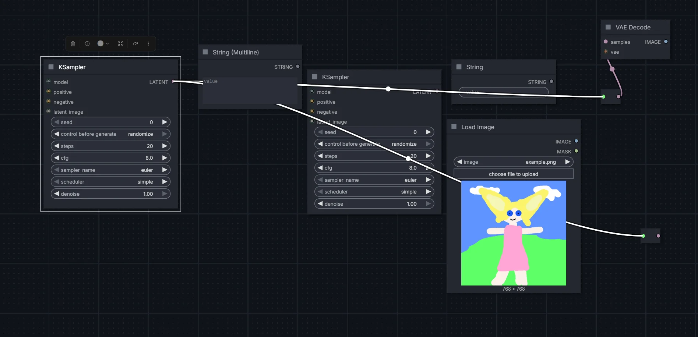

# ComfyUI-renderlinksontop

Changes link rendering behaviour in comfyui for selected nodes, highlighted links will render on top of nodes.

## Features

Links to and from highlighted nodes render above other nodes


## Installation

```bash
cd ComfyUI/custom_nodes
git clone https://github.com/Lumiyumi/comfyui_renderlinksontop
```

Restart ComfyUI after installation.